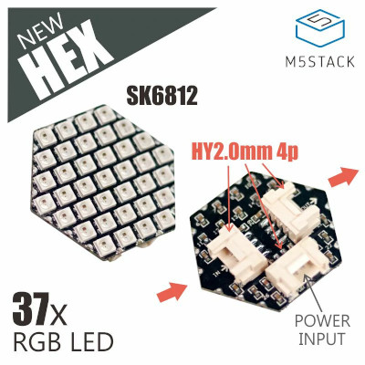

# Library m5stack-hex-sk6812-lib
A library to simplify the hexagons control.

The library is based on the official example:
https://github.com/m5stack/M5Stack/tree/master/examples/Unit/HEX_SK6812



# Getting the project
```
git clone https://github.com/colas-sebastien/m5stack-hex-sk6812-lib.git
```

Open the `m5stack-hex-sk6812-lib.ino` into Arduino IDE (pre-configure to support M5Stack)

# Test

By default the code can be run on **M5Stack / M5Atom** without any modifications.
Connect your Hex Module:
- Port B for M5Stack
- Only available port for M5Atom

If you want to run it on **M5Stick** (any version) modify the file `HexRGB.h` with the following value:
```
#define HEXRGB_PIN            32
```

To deploy connect your device and click on the `Upload` button into the Arduino IDE

# Support

You can chain multiple hex modules, it is fully supported by the library.

# Modify the code to make it yours

Modify the file `m5stack-hex-sk6812-lib.ino` to create your own projects.
Please the [Documentation](documentation.md) for more details.

# Version

Current release is 1.0.0 (Sept 2022)

# To do

- fill the list
