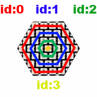

# Library documentation

The library is based on fastled library: https://fastled.io/docs


## Constructor

- HexRGB

## Constants

- HEXRGB_NUM_LEDS
- HEXRGB_NUM_LINES
- HEXRGB_NUM_DIAGONALS

## Stuctures

- [CRGB](https://fastled.io/docs/3.1/struct_c_r_g_b.html) (from fastled)

## Classes

- [CRGBPalette16](https://fastled.io/docs/3.1/class_c_r_g_b_palette16.html) (from fastled)

## Functions

- [border](#border)
- [border_gradient](#bordergradient)
- [browse](#browse)
- [color](#color)
- [diagonal](#diagonal)
- [fadeToBlack](#fadetoblack)
- [gradient](#gradient)
- [led](#led)
- [led_array](#ledarray)
- [line](#line)
- [rotation](#rotation)
- [show](#show)
- [triangle](#triangle)

<a name="index"></a>
## Led index
```
      00--01--02--03
     /              \  
    04  05  06  07  08 
   /                  \
  09  10  11  12  13  14
 /                      \   
15  16  17  18  19  20  21
 \                      /
  22  23  24  25  26  27
   \                  /
    28  29  30  31  32
     \              /
      33--34--35--36
```

# Constructor

# Constants

# Functions

<a name="border"></a>
## border

```
void border (int hex_id, CRGB color, int border_id);
```

Set an hexagon (`hex_id`) border(`border_id`) to a color (`color`).

<a name="bordergradient"></a>
## border_gradient
```
void border_gradient (int hex_id, CRGBPalette16 palette,int border_id,int index);
```

<a name="browse"></a>
## browse
```
uint8_t browse (int model,uint8_t index);
```

<a name="color"></a>
## color
```
void color (int hex_id, CRGB color);
```

Set an hexagon (`hex_id`) to a specific color (`color`)

<a name="diagonal"></a>
## diagonal
```
void diagonal (int hex_id, CRGB color, int diagonal_id);
```

<a name="fadetoblack"></a>
## fadeToBlack
```
void fadeToBlack (int hex_id, uint8_t fadeBy);
```
Fade hegaxon leds (`hex_id`) down by the given scale (`fadeBy`). 

<a name="gradient"></a>
## gradient
```
void gradient (int hex_id, CRGBPalette16 palette, int direction,int index);
```

```
void gradient (int hex_ids[],int nb_hex, CRGBPalette16 palette, int direction,int index, int gap);
```

<a name="led"></a>
## led
```
void led (int hex_id, int led_id, CRGB color);
```
Set a led (`led_id`) in an hexagon (`hex_id`) to a specific color (`color`).

<a name="ledarray"></a>
## led_array
```
void led_array(int hex_id, CRGB color, uint8_t *led_array,int led_array_size);
```

<a name="line"></a>
## line
```
void line (int hex_id, CRGB color, int line_id);    
```

<a name="rotation"></a>
## rotation
```
void rotation (int hex_id, int rotation_id);    
```

<a name="show"></a>
## show
```
void show();    
```
Update all our controllers with the current led colors for all hexagons.

<a name="triangle"></a>
## triangle
```
void triangle (int hex_id, CRGB color); 
```

